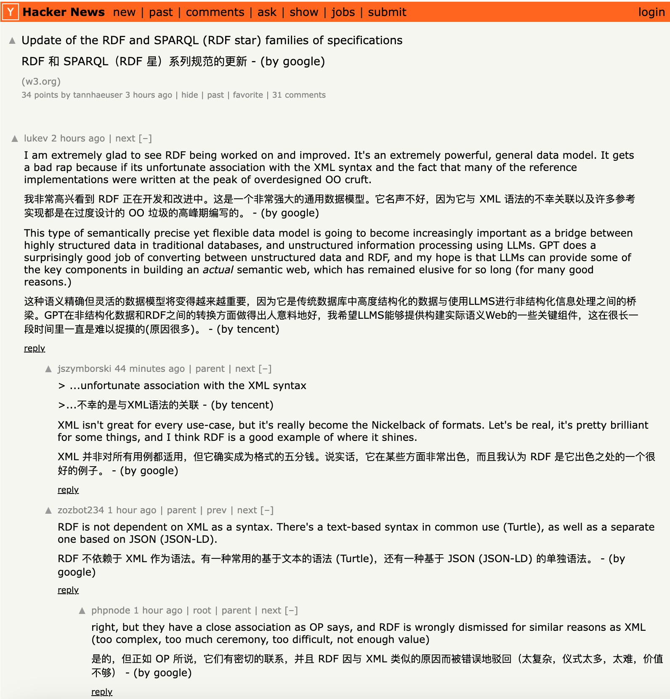

# transcat

transcat是一个翻译服务管理工具，主要任务是协调和管理多个不同的翻译服务(如Google，彩云小译，腾讯翻译君等)。transcat的特色功能是**负载均衡**，你可以自由组合不同的翻译服务来实现负载均衡。

transcat提供了兼容沉浸式翻译(Immersive translate)的API，具体配置请参考: [沉浸式翻译API](#与沉浸式翻译(Immersive translate)集成)



## 支持的服务

Google翻译 ✅

腾讯翻译君 ✅

百度翻译 ✅

彩云小译 ✅

微软翻译

## 配置

启动服务需要加载一个配置文件，格式如下：

```json
{
  "server_address": "127.0.0.1",
  "server_port": "8086",
  "datasource": {
    "type": "sqlite"
  },
  "services": [
    {
      "name": "google_translate1",
      "type": "google",
      "proxy": "http://127.0.0.1:7890",
      "weight": 3,
      "limit": 500000
    },
    {
      "name": "tencent",
      "type": "tencent", //腾讯翻译君
      "app_key": "app_key",
      "app_id": "app_id",
      "region": "region", //选填,默认值: ap-guangzhou
      "weight": 2,
      "limit": 500000,
      "ratelimit": {
        "type": "token-bucket",
        "capacity": 5,
        "time_window": 1
      }
    },
    {
      "name": "caiyun1",
      "type": "caiyun", //彩云小译
      "app_key": "app_key",
      "weight": 2,
      "limit": 1000000,
      "ratelimit": {
        "type": "token-bucket",
        "capacity": 10,
        "time_window": 1
      }
    },
  ],
  "mode": "select",
  "load-balance-rule": "weight"
}
```

### 参数说明

* `server_address`  - 服务器监听地址，默认为127.0.0.1

* `server_port ` - 监听端口，默认8010

* `mode`  工作模式
  * **select** - 手动选择翻译服务(services)中的一个
  * **load-balance** - 程序自动负载均衡选择翻译服务，支持3种负载均衡策略

* `load-balance-rule`: 只有mode为load-balance这个配置才会被加载，可选项: 
  * **weight** - 根据service中配置的权重负载均衡，比如a、b，c的weight分别为1,2,3; 如果有7个请求，分别会命中1，2，3个请求命中a、b，c。
  * **round-robin** - 轮询选择
  * **usage** - 根据当前剩余用量选择，用量计算公式为: usage = limit - currentUsage。每次调用某个翻译服务，它的usage都会增加。比如翻译`HelloWorld`命中了`caiyun`，那么它的usage会增加10(字符长度)。
* services - 翻译服务数组
  * `name` - 名字可以随意起，不过必须唯一，否则启动会报错
  * `type` - 翻译服务类型，目前支持下面服务
    * googlex - Google翻译，直接调用它网页的API，不需要填写密钥。
    * baidu - 百度翻译，需要填写密钥。如果要用，建议高级认证，因为普通用户1秒限流1个请求。
    * tencent - 腾讯翻译君，需要填写申请到的密钥。
    * caiyun - 彩云小译，需要填写申请到的密钥。
  * `app_key` - 你翻译服务的app_key(或者叫token)，根据你翻译服务来填写
  * `app_id` - 翻译服务app_id，目前baidu和tencent都有这个参数
  * `weight` - 负载均衡权重，只有mode是load-balance会起作用。
  * `limit` - 每月的token数,当mode是load-balance，且rule为usage，这个值的大小会影响优先级
  * `proxy` - http代理，如果设置了，翻译服务会使用代理访问互联网。比如: http://127.0.0.1:7890
  * `ratelimit` - 配置限流，比如capacity=10, time_window=1，那么1秒内，最多只能接受10个请求
    * type - 目前仅支持`token-bucket`
    * capacity - token数量
    * time_window - 时间窗口


## 启动服务

**从源码启动**

```shell
python flight.py --config config.json
```

**安装到本地**

请先从release中下载最新版本到本地，执行下面命令

```shell
# 把{version}替换为你下载的版本
python -m pip install transcat-{version}.tar.gz
# 安装完后，通过下面命令启动服务
transcat --config config.json
```

上面两种方式，本地必须先安装python，推荐使用最新版。请把上面命令中的python替换为你实际本地的python版本，最低支持到3.7.0。


## 与沉浸式翻译(Immersive translate)集成

目前沉浸式翻译没有直接支持transcat，不过因为它支持DeeplX，transcat对它DeeplX的接口做了兼容，使用步骤如下:

1. 点击扩展的"选项"进入扩展主页

2. 点击主页下方的"开发者设置"，开启 Beta 测试特性

3. 基本设置中找到 DeepLX，输入自建 transcat的URL，如: http://127.0.0.1:8010/api/translate/deeplx/adapter?show_engine=1&disable_cache=0

   `show_engine` 参数为1时，翻译文字后面会带上翻译服务类型。比如

   ```shell
   #请求翻译原文: hello,world!
   #show_engine = 1: 你好，世界 - (by google)
   #show_engine = 0: 你好，世界
   ```

   `disable_cache` 默认为0。transcat会缓存翻译结果，如果下次翻译命中缓存，默认会直接从缓存中取出。如果`disable_cache` = 1，那么将忽略缓存直接调用翻译服务查询新的结果。**注意: 沉浸式翻译本身就会缓存翻译结果，因此如果你的参数有变动，请换一个网页查看效果。**


## REST-API

transcat提供了一些REST-API，可以通过API更改mode等，目前支持的API如下:

### 沉浸式翻译API

* POST: `/translate/deeplx/adapter`

* Content-Type: `application/json`

* query params

  * show_engine - 0: 不显示翻译引擎 1-显示翻译引擎，默认为0
  * disable_cache - 是否禁止cache 0: 不禁止 1-禁止，默认为1

* body

  ```json
  {
  	"text": "hello world",
  	"source_lang": "en",
  	"target_lang": "zh"
  }

* Response

  ```json
  {
    "code": 200,
    "id": 123321,
    "data": '你好 世界',
    "alternatives": []
  }
  ```

### 切换Mode

运行时改变mode，如把select改为load-balance

* PUT: `/translate/mode/switch`

* Content-Type: `application/x-www-form-urlencoded`

* Params
  * mode - `[select | load-balance]`
  * rule - `[weight | round-robin | usage]`，当mode为load-balance时，rule必填


### 切换翻译服务

当mode为select时，可以通过这条API选择某个翻译服务

* PUT: `/translate/select`
* Content-Type: `application/x-www-form-urlencoded`
* Params
  * index - 服务列表中的index


## TODO

Web-UI

选择某个服务翻译的API


